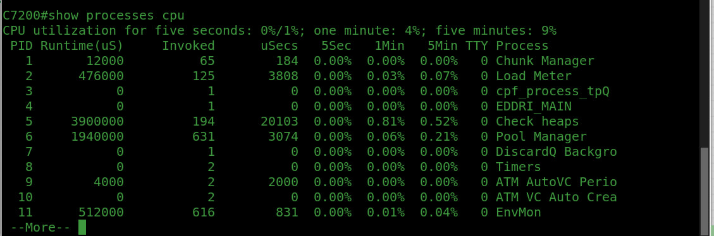
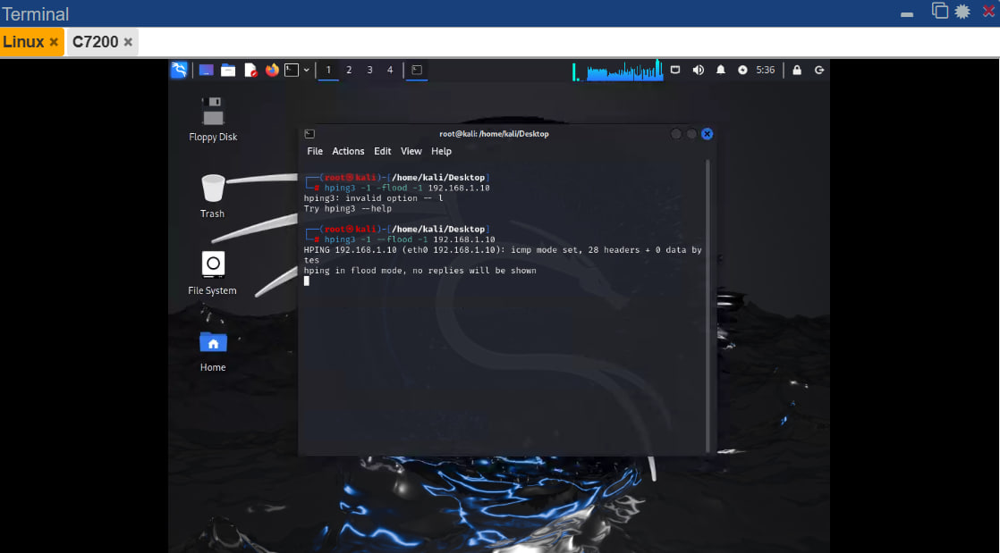
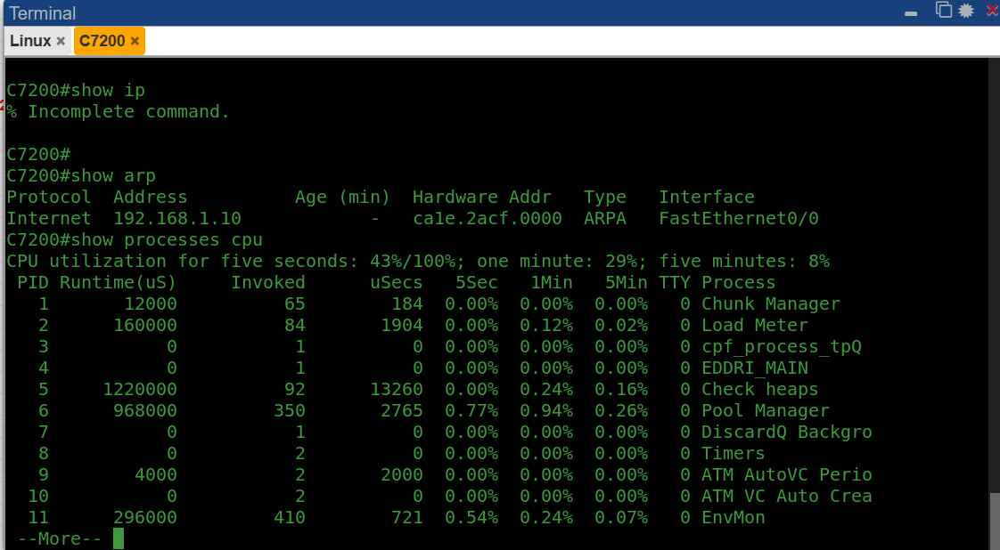

# cyber-security-attacks-test
Analyzing cyber security attacks with PnetLab for a bachelor's project

___


## DOS ATTACK: ICMP Flood Attack


### Kali Configuration:

1. On Kali Linux, Open Network connection window and click on Ethernet, then wired connection.
2. Under IPv4 settings tab, add a new static address:
    e.g. 
    | Address | Netmask | Gateway |
    | ------- | ------- | ------- |
    |192.168.1.1|24     |         |
3. Then Save the settings.
4. To check if IP was assigned: go to terminal and type below command:
    ```
    $ sudo su
    ```
    then : 
    ```
    $ ifconfig
    ```

### Router Configuration:

- From router terminal enter below commands:

```
Router> en
Router#
Router# config t "or terminal"
Router(config)#
Router(config)# hostname R1
R1(config)#
R1(config)# interface f0/0
R1(config-if)#
R1(config-if)# ip address 192.168.1.10 255.255.255.0
R1(config-if)# no shutdown
R1(config-if)# exit
R1(config)#
R1(config)# exit
R1#
R1# do wr
```

- To check the connection, we could ping from either router or kali:
```
R1# ping 192.168.1.1

or 

$ ping 192.168.1.10
```
- Before the attack, check the router cpu performance:
```
R1# show processes cpu
```

- From kali linux:
```
$ hping3 -1 --flood -1 192.168.1.10
```


$note:$ if we run this commad for more than 2 minutes, the target device will go down.

- The check the router cpu performance again:



- From kali wireshark or the embedded one on pnetlab we could observe huge amount of ECHO was sent to the target device.

- From router:
```
R1# debug ip icmp

R1# u all
```

___
