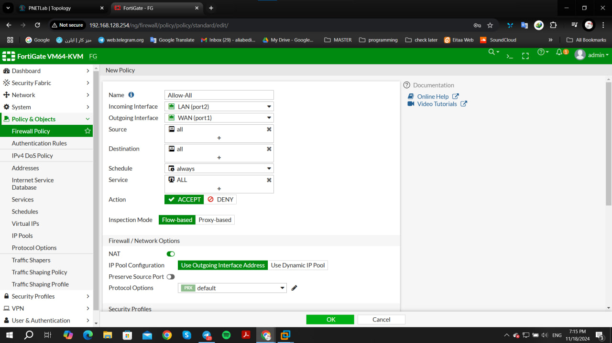

# cyber-security-attacks-test
Analyzing cyber security attacks with PnetLab for a bachelor's project
___

## Fortigate firewall topology

##### Setup firewall:
    ➢ username : admin
    ➢ password : hit Enter if not been set, then set a new password
    ➢ Show system interfaces
    ➢ config system interfaces
    ➢ edit port1 (if it’s necessary)

- Login through wed browser:

- Setup DNS to be able to transfer Internet throughout the entire network:

- Setup Network interfaces:

- Setup Static Routes to create connection between gateway and port1:

- Setup Firewall Policies:

- Setup dhcp server for inter-communication:

- From kali tinycore, and from control panel > network tab, set dhcp broadcast to yes:

- After done these requirements, we should be able to use the Internet:

- From our firewall logs and report tab > froward traffic:

- From another side of the network, first we need to check the IP address of PC1, and then try to connect linux tinycore from other side of the network:

- Again view our traffic through “forward traffic” tab:

- Test inter-connections:

___