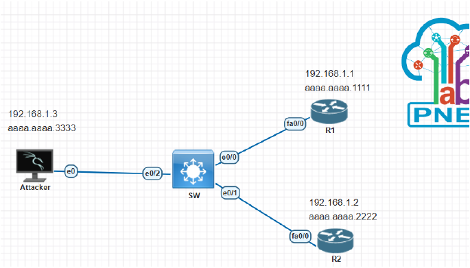
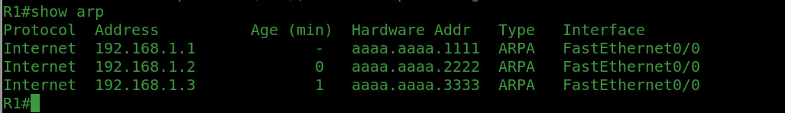
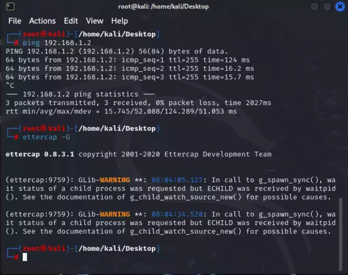
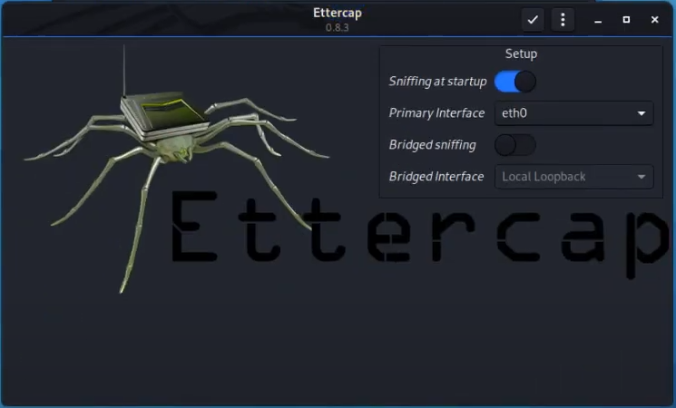
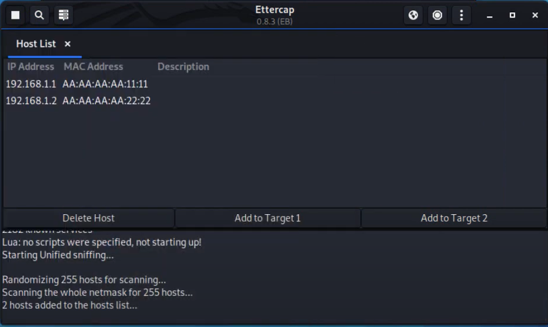
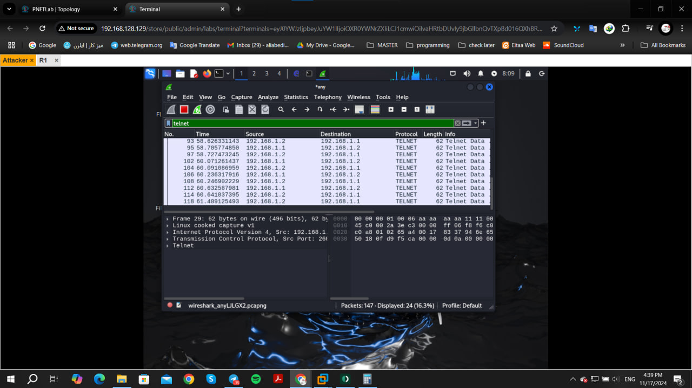
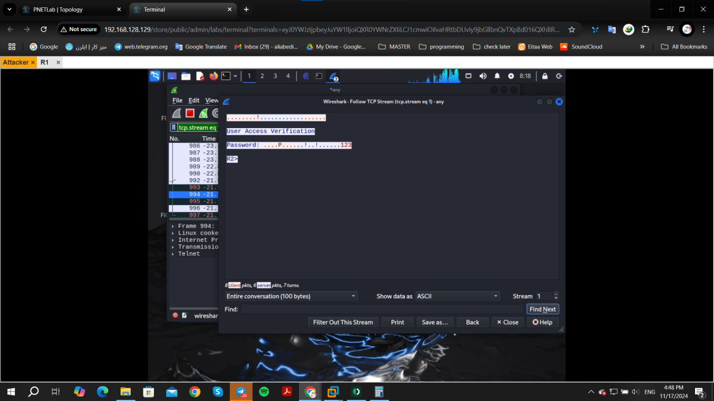
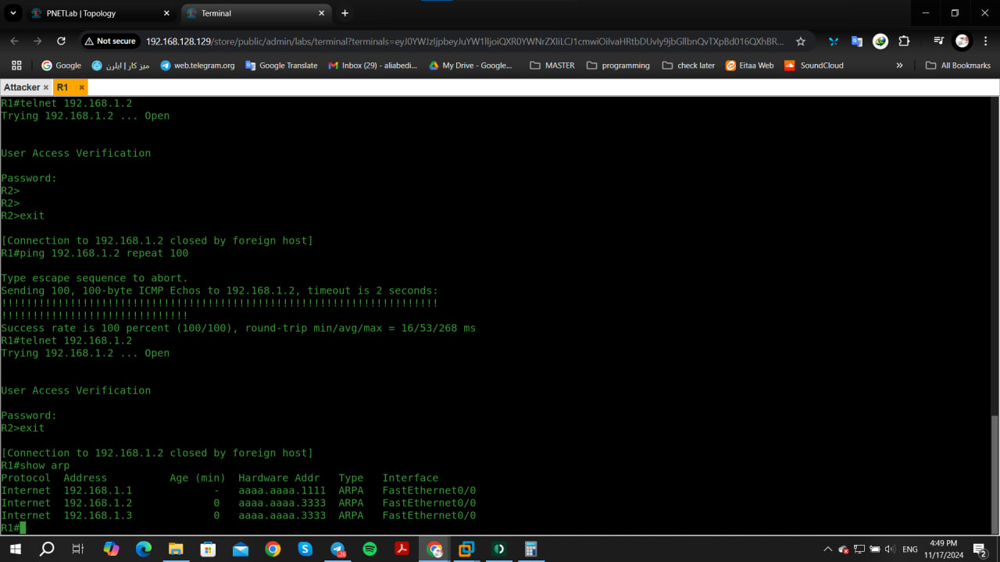
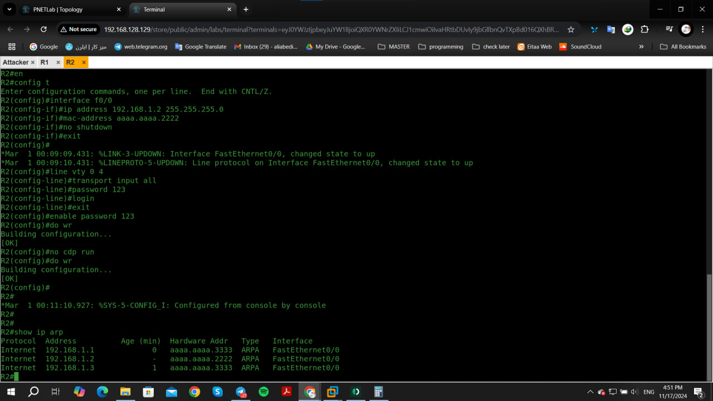

# cyber-security-attacks-test
Analyzing cyber security attacks with PnetLab for a bachelor's project
___


## MITM attack

- MITM (Man in The Middle) means man in the middle of your conversation.
- In a Man-in-The-Middle attack, attackers place themselves between two devices.
- MITM attack to intercept or modify communications between the two devices.
- MITM cyberattacks allow attackers to secretly intercept communications.
- MITM attack happens when hacker inserts themselves between a user & apps.
- Attackers have many different reasons and methods for using a MITM attack.
- MITM is used to steal something, like credit card numbers or user login credentials.
- MITM attacks involve interception of communication between two digital systems.
- A MITM attack is when an attacker intercepts communications between two parties.
- The man-in-the middle attack intercepts a communication between two systems.



### config R1 and R2 :

```
Router> en
Router#
Router# config t "or terminal"
Router(config)#
Router(config)# hostname R1
R1(config)#
R1(config)# interface f0/0
R1(config-if)#
R1(config-if)# ip address 192.168.1.1 255.255.255.0
R1(config-if)# mac-address aaaa.aaaa.1111
R1(config-if)# no shutdown
R1(config-if)# do wr
R1(config-if)# exit
R1(config)# line vty 0 4
R1(config-line)#
R1(config-line)# transport input all
R1(config-line)# password 123
R1(config-line)# login
R1(config-line)# exit
R1(config)# 
R1(config)# enable password 123
R1(config)# do wr
```

- Same thing for R2 is done.
```
Router> en
Router#
Router# config t "or terminal"
Router(config)#
Router(config)# hostname R1
R2(config)#
R2(config)# interface f0/0
R2(config-if)#
R2(config-if)# ip address 192.168.1.2 255.255.255.0
R2(config-if)# mac-address aaaa.aaaa.2222
R2(config-if)# no shutdown
R2(config-if)# do wr
R2(config-if)# exit
R2(config)# line vty 0 4
R2(config-line)#
R2(config-line)# transport input all
R2(config-line)# password 123
R2(config-line)# login
R2(config-line)# exit
R2(config)# 
R2(config)# enable password 123
R2(config)# do wr
```
- On Kali Linux, Open Network connection window and click on Ethernet, then wired connection.
- Under IPv4 settings tab, add a new static address:
    e.g. 
    | Address | Netmask | Gateway |
    | ------- | ------- | ------- |
    |192.168.1.3|24     |         |
- Then Save the settings.
- Now on the terminal we setup mac address:
```
$ macchanger -m aa:aa:aa:aa:33:33 eth0
```


- Now we can attack as shown below:




- Now the results of the attack:



- Compare these two with the first one earlier:


___
