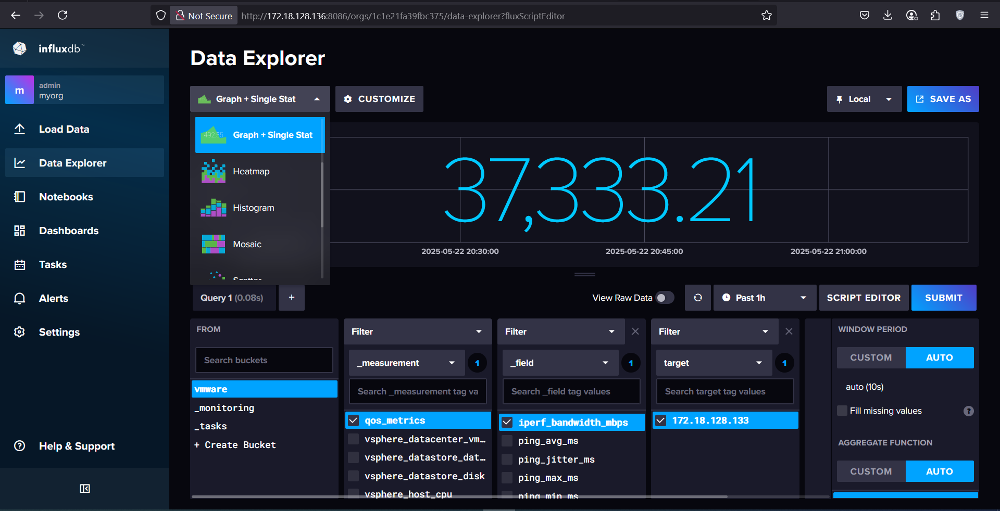

# QoS Network Monitoring Report

## Abstract
This report describes the operation of three primary network Quality of Service (QoS) monitoring scripts—`ping_test.py`, `iperf_test.py`, and `http_test.py`—along with the shell script `starter.sh`. The data produced by each script is continuously written to an InfluxDB instance for subsequent analysis.

## Introduction
Monitoring network QoS is essential to ensure the stability and performance of network infrastructure. In this project, three distinct tools were employed to measure latency (ping), bandwidth (iperf3), and HTTP performance. A shell script (`starter.sh`) orchestrates parallel execution of these tools and forwards their metrics to InfluxDB.

## Overall Architecture
All scripts are launched by the `starter.sh` script, which performs the following tasks:
- Executes the three Python scripts in parallel  
- Prints each process’s PID for traceability  
- Waits for all background processes to complete  

### `starter.sh`
```bash
#!/bin/bash

trap 'echo "Stopping all jobs…"; kill $(jobs -p) 2>/dev/null; exit' SIGINT SIGTERM EXIT

echo "Starting QoS monitoring scripts…"

python3 ping_test.py &
python3 iperf_test.py &
python3 http_test.py &

echo "Started ping_test.py with PID $!"
echo "Started iperf_test.py with PID $!"
echo "Started http_test.py with PID $!"

wait
```
.png)
.png)

## Script Descriptions

### `ping_test.py`

Utilizing the `icmplib` library, this script sends five ICMP echo requests to a specified target and computes:

* Average round-trip time (RTT)
* Minimum and maximum RTT
* Jitter
* Packet loss percentage

Each measurement cycle (every 60 seconds) is packaged into an InfluxDB `Point` under the measurement name `qos_metrics` and written to the database.

```python
import time
from icmplib import ping
from influxdb_client import InfluxDBClient, Point, WriteOptions

INFLUX_URL = "http://localhost:8086"
INFLUX_TOKEN = "your_influx_token"
INFLUX_ORG = "myorg"
INFLUX_BUCKET = "your_bucket"
TARGET_IP = "pnetlab_ip"

client = InfluxDBClient(url=INFLUX_URL, token=INFLUX_TOKEN, org=INFLUX_ORG)
write_api = client.write_api(write_options=WriteOptions(batch_size=1))

while True:
    result = ping(TARGET_IP, count=5, interval=0.2, timeout=1, privileged=True)
    avg_rtt = result.avg_rtt
    min_rtt = result.min_rtt
    max_rtt = result.max_rtt
    jitter = result.jitter
    packet_loss = result.packet_loss * 100

    point = Point("qos_metrics").tag("target", TARGET_IP) \
        .field("ping_avg_ms", avg_rtt) \
        .field("ping_min_ms", min_rtt) \
        .field("ping_max_ms", max_rtt) \
        .field("ping_jitter_ms", jitter) \
        .field("ping_packet_loss_pct", packet_loss)
    write_api.write(bucket=INFLUX_BUCKET, org=INFLUX_ORG, record=point)

    print(f"[ping] avg={avg_rtt}ms, loss={packet_loss}%")
    time.sleep(60)
```

### `iperf_test.py`

This script uses the `iperf3` command-line tool to measure throughput and jitter at the transport layer. The JSON output is parsed to extract:

* Average bandwidth (Mbps)
* Jitter (ms)

Metrics are then written to InfluxDB every 60 seconds.

```python
import subprocess
import json
import time
from influxdb_client import InfluxDBClient, Point, WriteOptions

INFLUX_URL = "http://localhost:8086"
INFLUX_TOKEN = "your_influx_token"
INFLUX_ORG = "myorg"
INFLUX_BUCKET = "your_bucket"
IPERF_SERVER = "localhost"
IPERF_PORT = 5201
IPERF_DURATION = 10

client = InfluxDBClient(url=INFLUX_URL, token=INFLUX_TOKEN, org=INFLUX_ORG)
write_api = client.write_api(write_options=WriteOptions(batch_size=1))

while True:
    try:
        result = subprocess.run(
            ["iperf3", "--client", IPERF_SERVER, "--port", str(IPERF_PORT), "--time", str(IPERF_DURATION), "--json"],
            stdout=subprocess.PIPE, stderr=subprocess.PIPE, text=True, timeout=IPERF_DURATION + 5
        )
        if result.returncode != 0:
            print("iperf3 failed:", result.stderr)
            time.sleep(60)
            continue
        output = json.loads(result.stdout)
        bandwidth_mbps = output['end']['sum_received']['bits_per_second'] / 1_000_000
        jitter_ms = output.get('end', {}).get('sum', {}).get('jitter_ms', 0)

        point = Point("qos_metrics").tag("target", IPERF_SERVER) \
            .field("iperf_bandwidth_mbps", bandwidth_mbps) \
            .field("iperf_jitter_ms", jitter_ms)
        write_api.write(bucket=INFLUX_BUCKET, org=INFLUX_ORG, record=point)

        print(f"[iperf] bandwidth={bandwidth_mbps} Mbps, jitter={jitter_ms} ms")
    except Exception as e:
        print("iperf3 error:", e)

    time.sleep(60)
```

### `http_test.py`

This script conducts three HTTP tests:

1. Simple HTTP GET to measure response time (HTTP ping)
2. Downloading a binary file to measure download latency and size
3. Uploading 100 KB of data to measure upload latency

Results (timings and HTTP status codes) are written to InfluxDB at one-minute intervals.

```python
import time
import requests
from influxdb_client import InfluxDBClient, Point, WriteOptions

INFLUX_URL = "http://localhost:8086"
INFLUX_TOKEN = "your_influx_token"
INFLUX_ORG = "myorg"
INFLUX_BUCKET = "your_bucket"
TARGET_IP = "pnetlab_ip"
HTTP_URL = f"http://{TARGET_IP}"
DOWNLOAD_URL = f"http://{TARGET_IP}/testfile.bin"
UPLOAD_URL = f"http://{TARGET_IP}/upload"

client = InfluxDBClient(url=INFLUX_URL, token=INFLUX_TOKEN, org=INFLUX_ORG)
write_api = client.write_api(write_options=WriteOptions(batch_size=1))

def measure_download(url):
   start = time.time()
   try:
       r = requests.get(url, timeout=10)
       elapsed = time.time() - start
       return elapsed * 1000, r.status_code, len(r.content)
   except:
       return None, None, 0

def measure_upload(url, data_bytes):
   start = time.time()
   try:
       r = requests.post(url, data=data_bytes, timeout=15)
       return (time.time() - start) * 1000, r.status_code
   except:
       return None, None

while True:
   try:
       start = time.time()
       r = requests.get(HTTP_URL, timeout=5)
       http_ping_time = (time.time() - start) * 1000
       http_status = r.status_code
   except:
       http_ping_time = None
       http_status = None

   dl_time, dl_status, dl_size = measure_download(DOWNLOAD_URL)
   ul_time, ul_status = measure_upload(UPLOAD_URL, b'a' * 1024 * 100)

   point = Point("qos_metrics").tag("target", TARGET_IP) \
       .field("http_ping_ms", http_ping_time or 0) \
       .field("http_status_code", http_status or -1) \
       .field("http_download_ms", dl_time or 0) \
       .field("http_download_bytes", dl_size or 0) \
       .field("http_download_status", dl_status or -1) \
       .field("http_upload_ms", ul_time or 0) \
       .field("http_upload_status", ul_status or -1)
   write_api.write(bucket=INFLUX_BUCKET, org=INFLUX_ORG, record=point)

   print(f"[http] ping={http_ping_time} ms, dl={dl_time} ms, ul={ul_time} ms")
   time.sleep(60)
```

## Data Storage and Visualization

All collected metrics are stored in a designated InfluxDB bucket. This setup enables visualization in Grafana dashboards or any other time-series analysis tool.


.png)
.png)

## Sample Results (June 6, 13:00–15:00)

* **Average HTTP upload latency:** 19.3 ms
* **Average iperf bandwidth:** 36,780 Mbps
* **Average ping RTT:** 0.51 ms
* **Average HTTP ping:** 90.5 ms


## Conclusion

The combination of these scripts provides automated, continuous monitoring of critical QoS metrics. By storing data in InfluxDB and visualizing via Grafana, network issues can be identified and addressed more rapidly, ensuring service quality.
