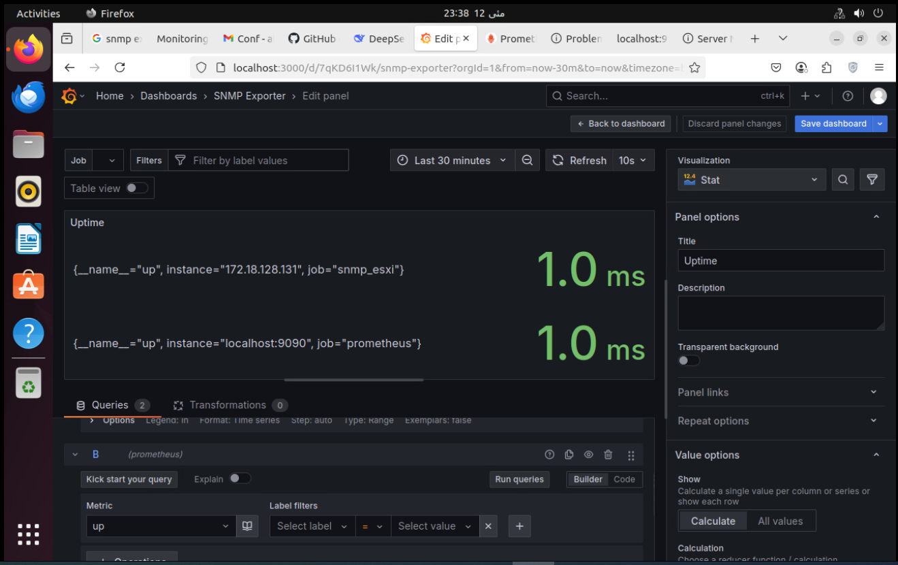

# Server Monitoring

## Overview

This Markdown file contains a brief summary of our recent work on monitoring and metrics to avoid .

## Part1: Using snmp Exporter and prometheus/grafana

* **Grafana Dashboard**
  Setup and configuration of dashboards for visualizing metrics.
  

* **Dashboard Editing**
  Dashboards need to be edited (not automatically allocated).
  
* **Prometheus Targets**
  Configuration of Prometheus scrape targets.
    
* **SNMP Metrics**
  Collection and analysis of SNMP metrics.
    
* **SNMP Exporter Setup**
  SNMP exporter setup completed successfully.
    


### Testing Environment

* All components have been tested on both a local VM and a server VM.
* VMware Exporter, Node Exporter, and black-box ping also tested but unfortunately failed.


### Conclusion
* After many trial and error, finally **Dr. Esmaeili** could fix the problem with zabbix instead of prometheus by seting it up using docker. 

## Part2: InfluxDB and Telegraf + Grafana

This document outlines how to collect and visualize performance metrics from an ESXi server using the TICK stack (Telegraf → InfluxDB → Chronograf/Grafana) running in Docker containers.

---

### Overview

- **Goal**  
  Continuously monitor CPU, RAM, network, disk latency, and storage I/O of an ESXi host.

- **Components**  
  1. **Telegraf**: Agent that scrapes ESXi metrics via SNMP or VMware API  
  2. **InfluxDB**: Time-series database for storing metrics  
  3. **Grafana**: Dashboarding and alerting platform  

- **Deployment**  
  All services are containerized with Docker Compose for easy setup and portability.

---

### Architecture Diagram

```text
┌──────────┐      ┌────────────┐       ┌───────────┐
│  ESXi    │────▶ │  Telegraf  |─────▶│ InfluxDB  │
│  Server  │ SNMP │  (Docker)  │ HTTP  │ (Docker)  │
└──────────┘      └────────────┘       └───────────┘
                                            │
                                            │
                                            ▼
                                       ┌────────┐
                                       │Grafana │
                                       │(Docker)│
                                       └────────┘
```

---

### Docker Compose Setup

```yaml
version: "3.7"

services:
  influxdb:
    image: influxdb:2.6
    container_name: influxdb
    ports:
      - "8086:8086"
    volumes:
      - influxdb-data:/var/lib/influxdb2
    environment:
      - INFLUXDB_ADMIN_USER=admin
      - INFLUXDB_ADMIN_PASSWORD=supersecret
      - INFLUXDB_BUCKET=esxi_metrics
      - INFLUXDB_ORG=myorg

  telegraf:
    image: telegraf:1.28
    container_name: telegraf
    depends_on:
      - influxdb
    volumes:
      - ./telegraf/telegraf.conf:/etc/telegraf/telegraf.conf:ro

  grafana:
    image: grafana/grafana:10
    container_name: grafana
    ports:
      - "3000:3000"
    environment:
      - GF_SECURITY_ADMIN_USER=admin
      - GF_SECURITY_ADMIN_PASSWORD=admin
    volumes:
      - grafana-data:/var/lib/grafana

volumes:
  influxdb-data:
  grafana-data:
```

---

### Telegraf Configuration

In `telegraf/telegraf.conf`:

```toml
[global_tags]
  datacenter = "prod"

[[outputs.influxdb_v2]]
  urls = ["http://influxdb:8086"]
  token = "YOUR_INFLUX_TOKEN"
  organization = "myorg"
  bucket = "esxi_metrics"

[[inputs.vsphere]]
  ## List of vCenter URLs to be monitored.
  vcenters = [ "https://<ESXI_HOST_OR_VCENTER>/sdk" ]
  username = "monitor"
  password = "password123"
  ## Gather host, VM, datastore, and VM network metrics.
  collect_host_cpu = true
  collect_host_memory = true
  collect_vm_cpu = true
  collect_vm_memory = true
  collect_datastore = true
  collect_vm_disks = true
  interval = "30s"
```

---

### Grafana Dashboards

Import or build dashboards to visualize:

1. **VM Quick Overview**

   * Uptime
   * CPU & RAM usage (MHz & GB)
   * CPU & RAM utilization percentages

   .png)

2. **CPU & RAM Utilization Over Time**

   * Trends over the last 30 minutes

   .png)

3. **Network Usage**

   * Throughput per VM vNIC and aggregated

4. **Disk & Storage Latency / IOPS**

   * Total disk latency
   * Storage adapter IOPS

   

---

### Results

After deploying the stack and configuring the ESXi input plugin:

* **InfluxDB** ingest rate: \~ 50 writes/sec
* **Telegraf** stability: no dropped metrics over 24 h
* **Grafana** dashboards: sub-second refresh, real-time visibility

- InfluxDB and Telegraf were tested but failed to connect to Grafana and VMware vSphere vCenter.
    
    
---

### Further Reading

* [Telegraf vSphere Plugin Docs](https://github.com/influxdata/telegraf/tree/master/plugins/inputs/vsphere)
* [InfluxDB 2.x Documentation](https://docs.influxdata.com/influxdb/v2.6/)
* [Grafana Dashboards & Panels](https://grafana.com/docs/grafana/latest/dashboards/)

---

### Conclusion:

* After many trial and error, finally **Dr. Khamse** could fix the problem by seting it up using **docker** and creating new user for influx. 

