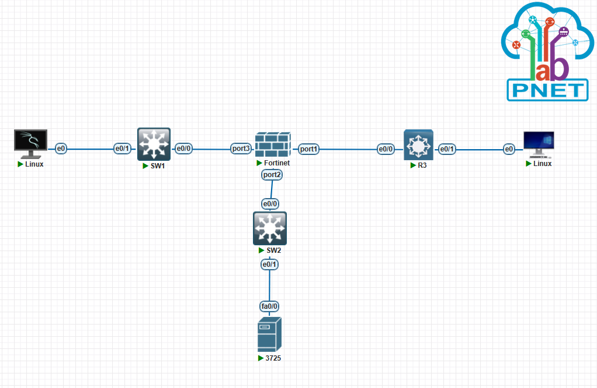

# DDOS SYN Flood Attack Lab with FortiGate Firewall



## Table of Contents
1. [Overview](#overview)
2. [Objectives](#objectives)
3. [Lab Topology & Environment](#lab-topology--environment)
4. [Prerequisites](#prerequisites)
5. [FortiGate Configuration](#fortigate-configuration)
   - [Interface & Zone Setup](#interface--zone-setup)
   - [IPv4 Addressing](#ipv4-addressing)
   - [Firewall Policies](#firewall-policies)
   - [DoS Policy (SYN Flood Protection)](#dos-policy-syn-flood-protection)
6. [SYN Flood Attack Implementation](#syn-flood-attack-implementation)
   - [Attacker Setup (Kali Linux)](#attacker-setup-kali-linux)
   - [Generating the SYN Flood](#generating-the-syn-flood)
   - [Monitoring Attack Traffic](#monitoring-attack-traffic)
7. [Observations & Results](#observations--results)
8. [Mitigation & Hardening](#mitigation--hardening)
9. [Cleanup](#cleanup)
10. [References](#references)

---

## Overview
In this lab, we simulate a TCP SYN flood attack launched by a Kali Linux attacker against a Cisco 3725 router acting as the victim server. The network is protected by a FortiGate firewall that will detect and block the SYN flood attack using its built-in DoS protection features.

## Objectives
- Launch a high-volume SYN flood from the Kali Linux attacker.
- Observe the impact on the victim Cisco 3725 router and FortiGate firewall.
- Configure FortiGate DoS policy to block SYN flood traffic.
- Validate that legitimate traffic is restored after mitigation.

## Lab Topology & Environment

- **Kali Linux (Attacker)** – `e0` → **SW1:e0/1**
- **SW1** – Layer 2 switch: `e0/0` → **FortiGate:port3**
- **FortiGate**
  - **port3 (WAN)** – Untrusted network
  - **port1 (LAN)** – Trusted network
  - **port2** → **SW2:e0/0**
- **SW2** – Layer 2 switch: `e0/1` → **Cisco 3725 (Victim)** on `fa0/0`

All devices operate on VLAN 1 with the following addressing scheme:

| Device          | Interface           | IP Address       | Network Mask  |
|-----------------|---------------------|------------------|---------------|
| Kali Linux      | e0                  | 1.1.1.1/30       | 255.255.255.252 |
| FortiGate (WAN) | port3               | 1.1.1.2/30       | 255.255.255.252 |
| FortiGate (LAN) | port1               | 192.168.2.1/24   | 255.255.255.0  |
| Cisco 3725      | fa0/0               | 192.168.2.2/24   | 255.255.255.0  |

## Prerequisites
- PnetLab topology loaded with the above diagram.
- Root/privileged access to Kali Linux and FortiGate GUI/CLI.
- `hping3` installed on Kali Linux: 
  ```bash
  sudo apt update && sudo apt install hping3 -y
  ```

## FortiGate Configuration

### Interface & Zone Setup
```shell
config system interface
  edit "port3"
    set alias "WAN"
    set ip 1.1.1.2/30
    set allowaccess ping https ssh
    set role wan
  next
  edit "port1"
    set alias "LAN"
    set ip 192.168.2.1/24
    set allowaccess ping https
    set role lan
  next
end
```

### IPv4 Addressing
- WAN network: **1.1.1.0/30** (FortiGate: .2, Kali: .1)
- LAN network: **192.168.2.0/24** (FortiGate: .1, Victim: .2)

### Firewall Policies
Allow inbound HTTP (TCP/80) from WAN to LAN for testing:
```shell
config firewall policy
  edit 1
    set name "WAN-to-LAN-HTTP"
    set srcintf "port3"
    set dstintf "port1"
    set srcaddr "all"
    set dstaddr "all"
    set action accept
    set service "HTTP"
    set nat disable
  next
end
```

### DoS Policy (SYN Flood Protection)
Enable SYN flood detection and mitigation:
```shell
config firewall DoS-policy
  edit 1
    set srcintf "port3"
    set dstintf "port1"
    set service "TCP"
    set status enable
    set anomaly enable
    set syn-flood enable
    set syn-flood-session-threshold 1000
    set syn-flood-block 60
    set log enable
  next
end
```

## SYN Flood Attack Implementation

### Attacker Setup (Kali Linux)
```bash
# Configure IP and route
sudo ip addr add 1.1.1.1/30 dev e0
sudo ip route add 192.168.2.0/24 via 1.1.1.2
# Verify configuration
echo "Kali e0 configured as $(ip -4 addr show e0 | grep -oP '(?<=inet )[^/]+')"
```

### Generating the SYN Flood
Flood TCP port 80 on the Cisco 3725 victim:
```bash
sudo hping3 -S --flood -p 80 192.168.2.2
```
- `-S`: Set SYN flag
- `--flood`: Send packets as fast as possible
- `-p 80`: Destination TCP port

### Monitoring Attack Traffic
- **On FortiGate CLI**:
  ```shell
  diagnose firewall DoS-policy statistics 1
  diagnose sys session list | grep SYN
  ```
- **On Cisco 3725**:
  ```shell
  show processes cpu | include IPv4
  show control-plane host open-ports | include 80
  ```

## Observations & Results
| Metric                       | Before Attack | During Attack | After Mitigation |
|------------------------------|--------------:|--------------:|-----------------:|
| FortiGate CPU Utilization (%)|            10  |            70 |                12 |
| Active SYN Sessions          |             3  |         12,000 |               150 |
| Drop Count (DoS policy)      |             0  |          11,500 |             11,500 |
| Victim Router CPU (%)        |            15  |            95 |                20 |
| HTTP Service Availability    | Available      | Unresponsive    | Restored         |

The SYN flood overwhelmed the victim and firewall until the DoS policy began dropping excess SYNs, restoring normal operation.

## Mitigation & Hardening
- Adjust `syn-flood-session-threshold` based on normal traffic.
- Enable **SYN Proxy** (`set tcp-session-pkt-threshold`).
- Use **Geo-IP blocking** for untrusted regions.
- Integrate **FortiAnalyzer** for automated attack alerts.

## Cleanup
1. Stop the flood: `Ctrl+C` on hping3.
2. Disable DoS policy (optional):
   ```shell
   config firewall DoS-policy
     edit 1
       set status disable
     next
   end
   ```
3. Clear sessions:
   ```shell
   diagnose sys session clear
   ```
4. Remove IP configuration on Kali:
   ```bash
   sudo ip addr del 1.1.1.1/30 dev e0
   sudo ip route del 192.168.2.0/24 via 1.1.1.2
   ```

## References
- HPNL Cyber Security Attacks Test: https://github.com/HPNL/cyber-security-attacks-test
- FortiGate Administration Guide (v6.4)
- `hping3` Manual: https://github.com/antirez/hping
