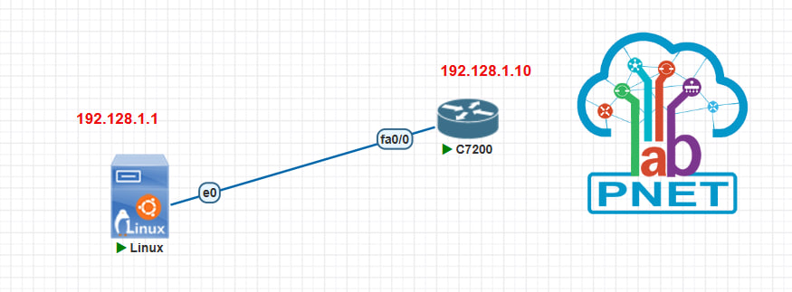

# cyber-security-attacks-test
Analyzing cyber security attacks with PnetLab for a bachelor's project
___

## Preview
- [DOS attack: ICMP Flood Attack](#dos-attack-icmp-flood-attack)
- [DDOS attack: SYN Flood Attack](#ddos-attack-syn-flood-attack)
- [MITM attack](#mitm-attack)
- [VLAN Hopping: double tagging method](#vlan-hopping-double-tagging-method)
- [Fortigate firewall topology](#fortigate-firewall-topology)

___


## DOS ATTACK: ICMP Flood Attack



### Kali Configuration:

1. On Kali Linux, Open Network connection window and click on Ethernet, then wired connection.
2. Under IPv4 settings tab, add a new static address:
    e.g. 
    | Address | Netmask | Gateway |
    | ------- | ------- | ------- |
    |192.168.1.1|24     |         |
3. Then Save the settings.
4. To check if IP was assigned: go to terminal and type below command:
    ```
    $ sudo su
    ```
    then : 
    ```
    $ ifconfig
    ```

### Router Configuration:

- From router terminal enter below commands:

```
Router> en
Router#
Router# config t "or terminal"
Router(config)#
Router(config)# hostname R1
R1(config)#
R1(config)# interface f0/0
R1(config-if)#
R1(config-if)# ip address 192.168.1.10 255.255.255.0
R1(config-if)# no shutdown
R1(config-if)# exit
R1(config)#
R1(config)# exit
R1#
R1# do wr
```

- To check the connection, we could ping from either router or kali:
```
R1# ping 192.168.1.1

or 

$ ping 192.168.1.10
```
- Before the attack, check the router cpu performance:
```
R1# show processes cpu
```

- From kali linux:
```
$ hping3 -1 --flood -1 192.168.1.10
```


$note:$ if we run this commad for more than 2 minutes, the target device will go down.

- The check the router cpu performance again:


- From kali wireshark or the embedded one on pnetlab we could observe huge amount of ECHO was sent to the target device.

- From router:
```
R1# debug ip icmp

R1# u all
```

___

## DDOS attack: SYN Flood Attack

- First we config the router:

```
Router> en
Router#
Router# config t "or terminal"
Router(config)#
Router(config)# hostname SRV
SRV(config)#
SRV(config)# interface f0/0
SRV(config-if)#
SRV(config-if)# ip address dhcp
SRV(config-if)# no shutdown
SRV(config-if)# exit
SRV(config)# ip http ser
SRV(config)# ip http authentication local
SRV(config)# username admin privilege 15 password 123
SRV(config)# do wr
SRV(config)# ^Z (ctrl + Z)
SRV# show ip

```
- Let's find out our kali linux ip:
    ```
    $ sudo su
    ```
    then : 
    ```
    $ ifconfig
    ```
- now we can access the SRV throuhg browser:


- If we check wireshark we could capture syn , [syn, ack], and ack as the three way handshaking of TCP:


- Now we are ready to attack:
```
hping3 -c 15000 -d 120 -w 64 -p 80 --flood --rand-source 192.168.128.140 
```

- The results are shown below:


- Now if we stop the attack after a few seconds, SRV is back to normal again. (pay attention to the time!):


___

## MITM attack

- MITM (Man in The Middle) means man in the middle of your conversation.
- In a Man-in-The-Middle attack, attackers place themselves between two devices.
- MITM attack to intercept or modify communications between the two devices.
- MITM cyberattacks allow attackers to secretly intercept communications.
- MITM attack happens when hacker inserts themselves between a user & apps.
- Attackers have many different reasons and methods for using a MITM attack.
- MITM is used to steal something, like credit card numbers or user login credentials.
- MITM attacks involve interception of communication between two digital systems.
- A MITM attack is when an attacker intercepts communications between two parties.
- The man-in-the middle attack intercepts a communication between two systems.


### config R1 and R2 :

```
Router> en
Router#
Router# config t "or terminal"
Router(config)#
Router(config)# hostname R1
R1(config)#
R1(config)# interface f0/0
R1(config-if)#
R1(config-if)# ip address 192.168.1.1 255.255.255.0
R1(config-if)# mac-address aaaa.aaaa.1111
R1(config-if)# no shutdown
R1(config-if)# do wr
R1(config-if)# exit
R1(config)# line vty 0 4
R1(config-line)#
R1(config-line)# transport input all
R1(config-line)# password 123
R1(config-line)# login
R1(config-line)# exit
R1(config)# 
R1(config)# enable password 123
R1(config)# do wr
```

- Same thing for R2 is done.
```
Router> en
Router#
Router# config t "or terminal"
Router(config)#
Router(config)# hostname R1
R2(config)#
R2(config)# interface f0/0
R2(config-if)#
R2(config-if)# ip address 192.168.1.2 255.255.255.0
R2(config-if)# mac-address aaaa.aaaa.2222
R2(config-if)# no shutdown
R2(config-if)# do wr
R2(config-if)# exit
R2(config)# line vty 0 4
R2(config-line)#
R2(config-line)# transport input all
R2(config-line)# password 123
R2(config-line)# login
R2(config-line)# exit
R2(config)# 
R2(config)# enable password 123
R2(config)# do wr
```
- On Kali Linux, Open Network connection window and click on Ethernet, then wired connection.
- Under IPv4 settings tab, add a new static address:
    e.g. 
    | Address | Netmask | Gateway |
    | ------- | ------- | ------- |
    |192.168.1.3|24     |         |
- Then Save the settings.
- Now on the terminal we setup mac address:
```
$ macchanger -m aa:aa:aa:aa:33:33 eth0
```


- Now we can attack as shown below:


- Now the results of the attack:


- Compare these two with the first one earlier:


___

## VLAN Hopping: double tagging method


___

## Fortigate firewall topology
