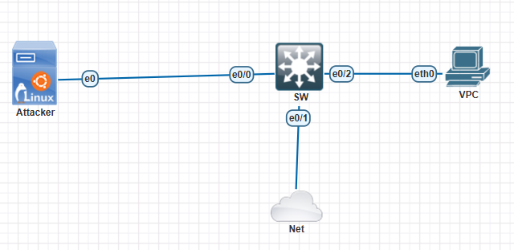
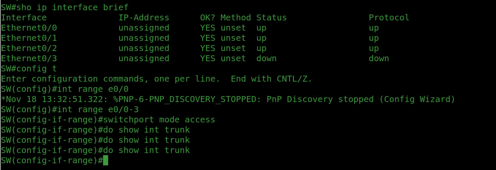
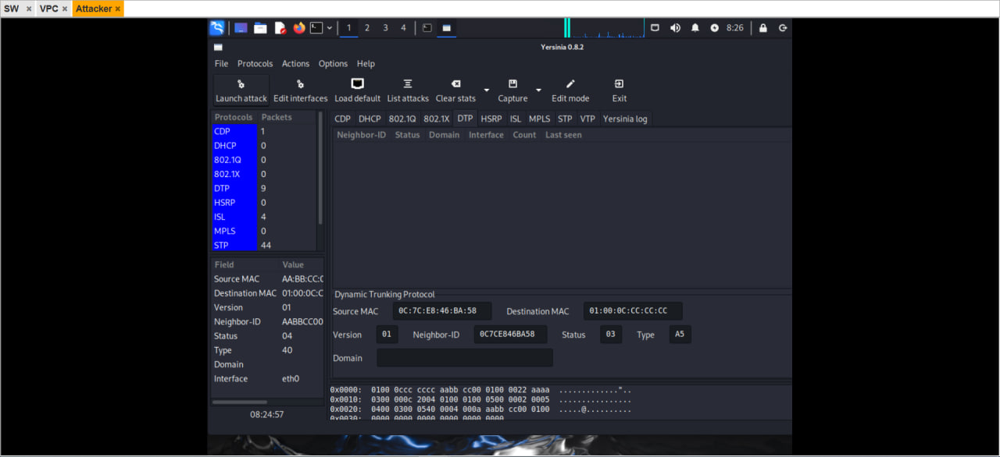
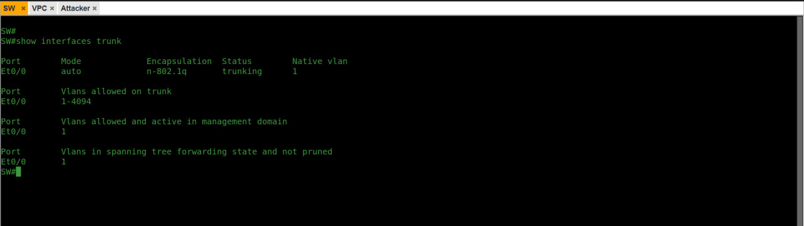
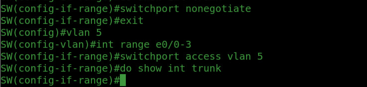

# cyber-security-attacks-test
Analyzing cyber security attacks with PnetLab for a bachelor's project
___

## VLAN Hopping: double tagging method
- Yersinia is used to launch the attack, focusing on Dynamic Trunking Protocol (DTP) vulnerabilities.
- The DTP protocol attempts to establish trunking between switches, which can be exploited if switches are not properly configured.
- The switch is configured to allow trunking, enabling access to multiple VLANs through VLAN 1.
- Using a double encapsulation attack, access to the network can be gained easily.
- To prevent the attack, interfaces should be converted to access ports across specified ranges.
- The command "show IP interface brief" can be used to monitor and manage the interfaces.
- Setting the port to access mode and using 'switchport nonegotiate' halts DTP packets from being sent.
- Creating a new VLAN instead of using the default VLAN 1 helps in managing network traffic more effectively.
- Verifying the configuration with 'show interface trunk' confirms that no trunks are present anymore.
- This method can be used to perform VLAN hopping attacks and mitigate them effectively using tools like Kali Linux.



### Install Yersinia On Kali Linux

- [How to install yersinia on kali ?](https://www.youtube.com/watch?v=v6CGKLXeKlA)

#### Before the Attack
- We shouldn't trunking with anybody:


#### Launching yersinia 



- result:
```
SW# show interfaces trunk
```


#### How to prevent that from happening ?

```
SW(config-if-range)#switchport nonegotiate
SW(config-if-range)#exit
SW(config)#vlan 5
SW(config-vlan)#int range e0/0-3
(config-if-range)#switchport access vlan 5
SW(config-if-range)#do show int trunk
SW(config-if-range)#
```


___
